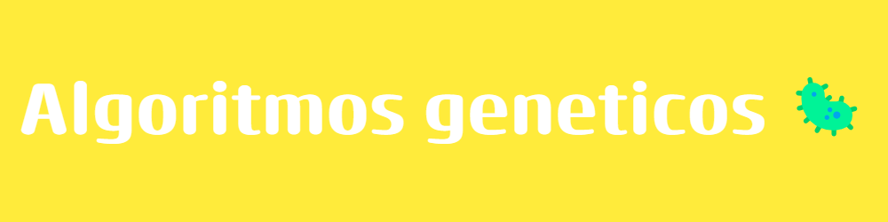

### Nombres
- Yamil Alan Gonzales Liendo
- Elias Cristhian Vilca Quispe
- Berly Esleider Vilca Argandoña
- Emmanuel del Piero Martinez Salcedo

# Algoritmos genéticos

Los algoritmos genéticos (AG) funcionan entre el conjunto de soluciones de un problema llamado fenotipo, y el conjunto de individuos de una población natural, codificando la información de cada solución en una cadena, generalmente binaria, llamada cromosoma. Los símbolos que forman la cadena son llamados genes. Cuando la representación de los cromosomas se hace con cadenas de dígitos binarios se le conoce como genotipo. Los cromosomas evolucionan a través de iteraciones, llamadas generaciones. En cada generación, los cromosomas son evaluados usando alguna medida de aptitud. Las siguientes generaciones (nuevos cromosomas), son generadas aplicando los operadores genéticos repetidamente, siendo estos los operadores de selección, cruzamiento, mutación y reemplazo.